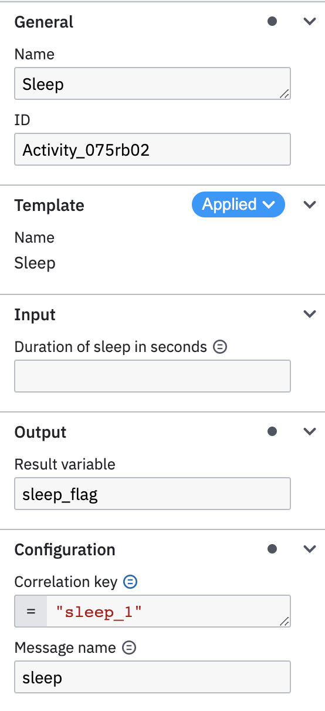

# Generate inbound template

We can create a template for `SleepConnector` using

``` console
$ generate_template example.SleepConnector example/sleep.json
Generated template for example.SleepConnector
```

!!! tip
	For more info on  template generation see [Generate outbound template](/quick_start/generate_outbound_template/).

## Template conversion

`SleepConnector` class have been converted to a template:

* `name` of the template was picked up from `ConnectorConfig.name`
* `zeebe:taskDefinition:type` was set to `ConnectorConfig.type` (not visible in Modeler).
* `duration` field of the `SleepConnector` was converted into a `zeebe:input` property.
* A `zeebe:taskHeader` with key 'resultVariable' was added to allow users define the name of the variable where the output of the `LogConnector.run` method will be stored.
* A 'Message name' and 'Correlation key' inputs were added.

=== "Template rendering"

	{ align=left, width="300" }

=== "example/sleep.json"

	``` json linenums="1" title="example/sleep.json"
	--8<-- "sleep.json"
	```

=== "example/sleep.py"

	```py linenums="1" title="example/sleep.py"
	--8<-- "sleep.py"
	```